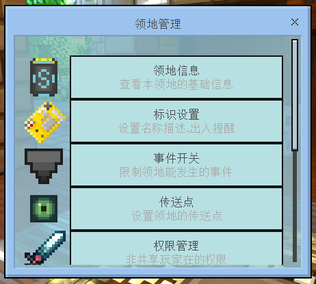
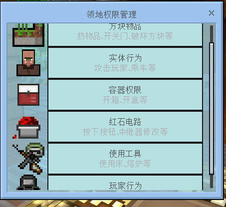
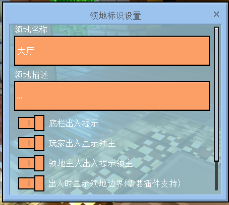
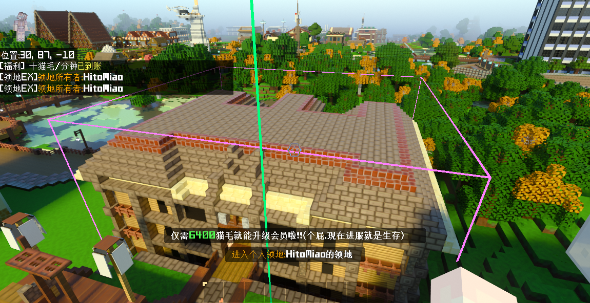

# LandEX - 新一代的地皮管理插件

LandEX是一个基于LLSE的MC地皮管理插件，基于JavaScript为玩家带来高效便捷的地皮使用体验。插件原生支持真指令注册，服内大量GUI管理，并可与OrgEX、LandEX与DrawLine插件联动。

### 联系作者

|  | https://github.com/VoryWork |
| ---------------------------------------------------------------------------------------------------------------------------------------- | --------------------------- |

## 插件特性

- **非常易用**：即使没有文档，大部分玩家也能自己摸索透。

- **多语言**：对语言进行导出，为多语言提供支持。

- **超多管理项**：精细划分玩家权限，对领地进行集约化管理

- **完全开源**：代码规范，绝无后门，欢迎监督！

- **双经济系统**：支持LLMoney与计分板双经济系统

- **多计费模式**：支持按面积\体积\混合模式计费

- **客制化**：支持服主修改各类配置

- **独立权限管理**：独立设置领地管理员，每片领地可单独设置分享的玩家

- **方便迁移**：支持从其他领地插件迁移数据

- **性能优越**：使用索引+缓存机制，极大减少了时间复杂度。

- **领地传送**：允许玩家设置传送点，快速传送到领地

- **领地转卖**：允许玩家自行设置价格转卖领地

## 使用截图

|  |  |  |
| ---------------------------------------------------------------------- | ------------------------------------------------------------------------ | ---------------------------------------------------------------- |

